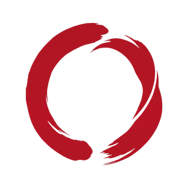

<p align="center">
  
</p>

<h1 align="center">genjutsu</h1>

<p align="center"><em>The art of illusion.</em><br />
Claude Code skills that make an interface move, give a product its look, and build a whole website.</p>

<p align="center">
  <a href="https://genjutsu.athevon.dev"><strong>Website</strong></a>
  &nbsp;·&nbsp;
  <a href="#examples"><strong>Examples</strong></a>
  &nbsp;·&nbsp;
  <a href="https://genjutsu.athevon.dev/docs"><strong>Documentation</strong></a>
  &nbsp;·&nbsp;
  <a href="https://genjutsu.athevon.dev/docs/install"><strong>Install</strong></a>
  &nbsp;·&nbsp;
  <a href="https://github.com/AThevon/genjutsu/discussions"><strong>Discussions</strong></a>
</p>

<p align="center">
  <a href="https://github.com/AThevon/genjutsu/releases/latest"></a>
  <a href="./LICENSE"></a>
  
  <a href="https://github.com/sponsors/AThevon"></a>
</p>

<p align="center">
  
  <br />
  <sub>genjutsu.athevon.dev, built with genjutsu, recorded from the real build: the lens resting on 幻 follows the pointer along three of its strokes and stops on the third. Wherever it passes, the ink gives way to what it is drawn from (centrelines, control points, brush footprints at their true size and angle) and a live readout of the footprint under it: stroke, position, pressure, radii, nib angle. The pointer leaves and the lens settles back to rest. The pointer is drawn in for the capture (a crosshair, like the site's own).</sub>
</p>

Creative coding skills for [Claude Code](https://claude.ai/code), [claude.ai](https://claude.ai) and [Cowork](https://claude.com/product/cowork). Web (React, Vue, Svelte, Astro, vanilla CSS, Three.js, Canvas), Android (Jetpack Compose, Compose Multiplatform) and Apple (SwiftUI, iOS and macOS). `bunshin` is web only for now.

## Install

```bash
npx skills add https://genjutsu.athevon.dev -g
```

Then describe the task in Claude Code, or type `/genjutsu`. To follow releases: `npx skills update -g`. Keep the `-g` on both, and use the URL, not the repository: `npx skills add AThevon/genjutsu` installs the skills without their modules.

Or as a Claude Code plugin, inside a session, which gives you `/genjutsu:cast`, `/genjutsu:paint` and `/genjutsu:bunshin`:

```text
/plugin marketplace add AThevon/genjutsu
/plugin install genjutsu
```

Project scope, claude.ai, Cowork, other agents and what bunshin needs beside it: [genjutsu.athevon.dev/docs/install](https://genjutsu.athevon.dev/docs/install).

## Three scales

The requests in the middle column are examples of what you might type, not recorded runs.

| | You type, for example | You get |
|---|---|---|
| **`cast`**<br />one interface moves | `/genjutsu:cast make the pricing cards feel physical on hover` | An interaction thesis you approve, shown the way you pick (a rendered page with a replay button, a route in your project, or one sentence), then the code in the stack you already use, with a short audit of what it wrote. |
| **`paint`**<br />a product's whole look | `/genjutsu:paint build me a portfolio from scratch` | A brainstorm, a visual and an interaction thesis, a `MASTER.md` design system for your stack, the page, and a full audit. On a project that already has a design, it asks first whether to keep the brand, change part of it, or redesign. |
| **`bunshin`**<br />a whole site, by a team of agents | `/genjutsu:bunshin redesign our architecture practice's whole site from the current one and our project PDFs` | It states its cost, then asks you twice: the tier, then the direction. An art director runs research, one builder per page, reviewers and fix rounds until a stop rule ends the loop. You get the site, `DESIGN.md`, `AGENTS.md` and a report of what was verified and what was not. |

Not sure which one? Ask for the result you want and the right skill is picked; `cast` and `paint` propose `bunshin` once, with its cost, when the brief is a whole site. [The FAQ](https://genjutsu.athevon.dev/docs/faq) has the long answer.

## Examples

<!-- genjutsu:examples:start -->
Recorded runs on fictional clients and one real one, captured from the code each run left or, for the real client, from the live site. Each one gives the first line of the request, how it ran, what it cost, and a receipt with the full prompt, what the run checked, and what it left unverified or got wrong. Everything they link lives in [genjutsu-examples](https://github.com/AThevon/genjutsu-examples) at the tag `readme-2026-10-05`: the code each run wrote, its receipt, its conversation and its media. A one-shot headless run is a single `claude plugin eval` session: the prompt answers the gates up front and nobody replies after that, so there is no conversation to publish. A conversation is a session in which an agent plays the client and answers the gates; its full transcript, the brief that agent was given and the first message it sent are linked. The `bunshin` example is the run `bunshin` was extracted from, made before v4.1.0 shipped: its cost is in subagent tokens, as genjutsu publishes it, and its request and its client's material stay private. A run on a build that is not a release names the branch and commit it ran on instead of a version.

### Nocturne: a planetarium's late program, from dusk to the real 22:00 sky (plain CSS)

<a href="https://github.com/AThevon/genjutsu-examples/blob/readme-2026-10-05/nocturne/receipt.md"></a>

`/genjutsu:paint build the landing page for Nocturne, the late program of a planetarium in Lisbon.`

A new page from an empty React template and a star catalogue. After questions on the mood and the hero, and its two theses shown as a rendered page, the run drew the dome from data/stars.json: 403 stars and Saturn where they stand over Lisbon at 22:00 on 9 October 2026. Scrolling from dusk to night deepens the ground, fades the amber glow at the rim and brings the stars up brightest first. 1440x900 viewport, scaled to 1100x688.

The client accepted both theses at the first showing and asked once for the four problems of the first report to be fixed. The run never saw its page and handed every visual check over. Three defects it introduced are in the receipt: from 1100 px wide the star list runs over the dome (near the end of the clip), a picked star's magnitude line covers its name, and on a phone the hero panel hides the bottom of the dome.

<sub>`paint` · conversation with an agent playing the client (Claude Code 2.1.289, one session resumed for each reply) · genjutsu fix/skill-arguments on 09c177b (4.1.1 candidate) · `claude-opus-5-5` · first pass · $5.93 (plus $0.86 for the agent playing the client) · 8 exchanges · 73 turns · 0 human edits · 2026-10-04</sub>

[Receipt](https://github.com/AThevon/genjutsu-examples/blob/readme-2026-10-05/nocturne/receipt.md) · [Transcript](https://github.com/AThevon/genjutsu-examples/blob/readme-2026-10-05/nocturne/transcript.md) · [Client brief](https://github.com/AThevon/genjutsu-examples/blob/readme-2026-10-05/nocturne/client.md) · [First message](https://github.com/AThevon/genjutsu-examples/blob/readme-2026-10-05/nocturne/opening.txt) · [Source](https://github.com/AThevon/genjutsu-examples/tree/readme-2026-10-05/nocturne/source)

### Chef Ovatio: a private chef's seven-page site in French and English (Astro)

<a href="https://github.com/AThevon/genjutsu-examples/blob/readme-2026-10-05/chef-ovatio/receipt.md"></a>

<em>No slash command: bunshin did not exist yet. A short request, in French, for a polished first draft of a private chef&#x27;s site, made with Impeccable from his public Instagram profile.</em>

A real client's site, from his public Instagram profile and two answers: the stack, the lead offer, the languages and the contact in one round of questions, then the direction, L'Affiche de la Riviera. Seven pages in French and English. Scrolling the home, the noon-yellow sky turns to sunset orange as the plate-sun sets behind the cobalt horizon, before the two doors, Recevoir and Conseiller, and the first plates. Filmed from the live site, 1440x900 viewport, scaled to 1200x750.

This is the run bunshin was extracted from, made with genjutsu 4.0.0's paint and Impeccable hours before bunshin shipped in 4.1.0; its cost is the figure genjutsu publishes for it. The second verdict still asked for fixes (five major points from the art director); the last round worked on them and no verdict read the site after it. The client's contact details and legal notice are still blanks marked for him to fill.

<sub>`bunshin` · bunshin run, before v4.1.0 (Claude Code 2.1.284, one main session driving subagents through eight workflows) · genjutsu 4.0.0 at `a0f6e09` (`paint`, with Impeccable) · `claude-opus-5-5` · about 10.5M subagent tokens over six to eight hours (main session not measured) · one review, three refine rounds, two verdicts · 2 human answers · 0 human edits · 2026-09-29</sub>

[Receipt](https://github.com/AThevon/genjutsu-examples/blob/readme-2026-10-05/chef-ovatio/receipt.md) · [Live demo](https://chef-ovatio.vercel.app) · Source: the client's private repository

### Atelier Grès: four firing stages pinned and scrubbed (GSAP ScrollTrigger)

<a href="https://github.com/AThevon/genjutsu-examples/blob/readme-2026-10-05/pottery-firing/receipt.md"></a>

`/genjutsu:cast pin our pottery studio's four firing stages and scrub them with the scroll`

The Atelier Grès page, its copy and its four stage blocks are the starting fixture. The run's work is the pinned section, the firing curve it draws, and the stage texts handing over to each other as the scroll scrubs through. 1440x900 viewport, scaled to 1200x750.

Headless, so the run marked its own thesis UNVALIDATED. It could not build in its sandbox; the build here passed on the first try with no edit.

<sub>`cast` · one-shot headless run (claude plugin eval, Claude Code 2.1.289) · genjutsu 4.1.0 at `09c177b` · `claude-opus-5-5` · first pass · $1.53 · 23 turns · 0 human edits · 2026-10-04</sub>

[Receipt](https://github.com/AThevon/genjutsu-examples/blob/readme-2026-10-05/pottery-firing/receipt.md) · No transcript: a one-shot run has no conversation, the full prompt is in the receipt · [Source](https://github.com/AThevon/genjutsu-examples/tree/readme-2026-10-05/pottery-firing/runs/20261004T162515Z/workspace-1) · [Case](https://github.com/AThevon/genjutsu-examples/tree/readme-2026-10-05/cases/pottery-firing)

### Étale: a slack-water app's beta page, from one real day of NOAA predictions (plain CSS)

<a href="https://github.com/AThevon/genjutsu-examples/blob/readme-2026-10-05/etale/receipt.md"></a>

`/genjutsu:paint build the landing page for Étale.`

A new page from an empty React template and one day of NOAA tide and current predictions. The founder pushed back twice, on an evening alert the read-back underplayed and on a flood the slack card skipped, and the run changed both. Every figure on the page comes from data/tide.json, labelled with its date and station. 1440x900 viewport, scaled to 1200x750: the page loads, holds its first screen, then scrolls to the two charts.

A first conversation on the same brief ran just before this one and is not shown. Two defects the run introduced are in the receipt: the dashed slack markers cross the chart labels, and the current line draws once on load, below the fold, so a visitor who scrolls down finds it already drawn.

<sub>`paint` · conversation with an agent playing the client (Claude Code 2.1.289, one session resumed for each reply) · genjutsu fix/skill-arguments on 09c177b (4.1.1 candidate) · `claude-opus-5-5` · selected from 2 runs · $3.55 (plus $1.08 for the agent playing the client) · 10 exchanges · 54 turns · 0 human edits · 2026-10-04</sub>

[Receipt](https://github.com/AThevon/genjutsu-examples/blob/readme-2026-10-05/etale/receipt.md) · [Transcript](https://github.com/AThevon/genjutsu-examples/blob/readme-2026-10-05/etale/transcript.md) · [Client brief](https://github.com/AThevon/genjutsu-examples/blob/readme-2026-10-05/etale/client.md) · [First message](https://github.com/AThevon/genjutsu-examples/blob/readme-2026-10-05/etale/opening.txt) · [Source](https://github.com/AThevon/genjutsu-examples/tree/readme-2026-10-05/etale/source)

### Folio: the "Mark as paid" action (Motion)

<a href="https://github.com/AThevon/genjutsu-examples/blob/readme-2026-10-05/invoice-mark-paid/receipt.md"></a>

`/genjutsu:cast the "Mark as paid" action in our invoice list is dead, make it feel like the money landed`

The Folio page is the starting fixture; the motion is the run's work. Two "Mark as paid" clicks: the amount leaves Outstanding and lands in Paid as both totals count, with a signed amount on each card. 1440x900 viewport, cropped; the pointer is drawn in by the recorder, it is not part of the build.

Headless, so the run marked its own thesis UNVALIDATED. It introduced one defect its own audit missed: on a shorter window, handing focus to the next unpaid invoice scrolls the page while the totals count (it does not show at 1440x900; the receipt describes when it does).

<sub>`cast` · one-shot headless run (claude plugin eval, Claude Code 2.1.289) · genjutsu 4.1.0 at `09c177b` · `claude-opus-5-5` · first pass · $1.88 · 45 turns · 0 human edits · 2026-10-04</sub>

[Receipt](https://github.com/AThevon/genjutsu-examples/blob/readme-2026-10-05/invoice-mark-paid/receipt.md) · No transcript: a one-shot run has no conversation, the full prompt is in the receipt · [Source](https://github.com/AThevon/genjutsu-examples/tree/readme-2026-10-05/invoice-mark-paid/runs/20261004T162510Z/workspace-1) · [Case](https://github.com/AThevon/genjutsu-examples/tree/readme-2026-10-05/cases/invoice-mark-paid)

### Recorded, not featured

These runs were recorded the same way and keep their receipts, but are not shown above, for the reason given on each line.

- **Atelier Grès: the whole site redesigned**: `paint`, conversation with an agent playing the client, genjutsu fix/skill-arguments on 09c177b (4.1.1 candidate), 2026-10-04. Thin execution: the platform system font, kept after a web font could not be fetched in the sandbox, and a blurred glow standing in for the kiln. [Receipt](https://github.com/AThevon/genjutsu-examples/blob/readme-2026-10-05/gres-redesign/receipt.md) · [Transcript](https://github.com/AThevon/genjutsu-examples/blob/readme-2026-10-05/gres-redesign/transcript.md) · [Client brief](https://github.com/AThevon/genjutsu-examples/blob/readme-2026-10-05/gres-redesign/client.md) · [First message](https://github.com/AThevon/genjutsu-examples/blob/readme-2026-10-05/gres-redesign/opening.txt) · [Source](https://github.com/AThevon/genjutsu-examples/tree/readme-2026-10-05/gres-redesign/source)
- **Étale, first headless run**: `paint`, one-shot headless run, genjutsu 4.1.0 at `09c177b`, 2026-10-04. Plain: correct and sourced, but nothing on the page goes past a tidy default; the conversation above replaced it. [Receipt](https://github.com/AThevon/genjutsu-examples/blob/readme-2026-10-05/etale-landing/receipt.md) · [Source](https://github.com/AThevon/genjutsu-examples/tree/readme-2026-10-05/etale-landing/runs/20261004T162451Z) · [Case](https://github.com/AThevon/genjutsu-examples/tree/readme-2026-10-05/cases/etale-landing)
- **Nocturne, first headless run**: `paint`, one-shot headless run, genjutsu 4.1.0 at `09c177b`, 2026-10-04. Plain: a correct sky chart on a flat blue page; the conversation above replaced it. [Receipt](https://github.com/AThevon/genjutsu-examples/blob/readme-2026-10-05/nocturne-planetarium/receipt.md) · [Source](https://github.com/AThevon/genjutsu-examples/tree/readme-2026-10-05/nocturne-planetarium/runs/20261004T162505Z) · [Case](https://github.com/AThevon/genjutsu-examples/tree/readme-2026-10-05/cases/nocturne-planetarium)
<!-- genjutsu:examples:end -->

## It shows you before it writes

`cast` and `paint` stop at a few gates (the interaction thesis, the visual identity, the design system) and ask once how you want to see the proposal: a rendered page with the easing curve plotted and a replay button, a throwaway preview route in your own project, or one sentence in the conversation. Whatever the form, it is a proposal: a preview route is deleted once you approve, and none of it becomes the implementation. While it works it narrates in short lines ("Casting parallax on hero scroll."); its reports are plain: what changed, the files touched, the next step.

## It names the slop, and measures itself

genjutsu keeps a catalogue of the defaults a model reaches for when nobody asked (the numbered eyebrow, three equal cards, an invented `ESTD. 2018`): [the tells field guide](https://genjutsu.athevon.dev/docs/tells). On web work larger than one hover or transition, a tell the run wrote is fixed before the final report (two passes at most, what remains is reported), unless the validated thesis names it. One command lists them in any project, each with its `file:line` and the question to answer:

```bash
python3 ~/.agents/skills/genjutsu/_jutsu/design-audit/scripts/audit.py . --group tells
```

The eval suite runs the same briefs with and without genjutsu:

<!-- genjutsu:showcase:start -->
| Brief | Tells, without genjutsu | Tells, with genjutsu | Grader score, with minus without |
|---|---|---|---|
| Independent design studio landing | 2 | 0 | +0.20 |
| Invoicing SaaS landing | 2 | 0 | +0.10 |

Tells are the findings of `audit.py --group tells` on the page of the first run of each arm. Scores come from `claude plugin eval --ablation with-without --runs 2` on genjutsu `ef31234`, over the suite in [`evals/`](./evals). The graders are ours: read this as genjutsu measured against what it set out to do, not as an independent benchmark.
<!-- genjutsu:showcase:end -->

These numbers count tells and grader checks. They do not say which page looks better: the page built without genjutsu can look as designed as the one built with it. Today's models rarely write some of the classic tells (an invented build status, an `ESTD. 2018`) on their own, so the gains are modest. The control case held: when a brief genuinely asks for two city clocks and the thesis names them, they stay on every run. Details in [`evals/README.md`](./evals/README.md).

## Docs

[Overview](https://genjutsu.athevon.dev/docs) · [Install](https://genjutsu.athevon.dev/docs/install) · [`cast`](https://genjutsu.athevon.dev/docs/cast) · [`paint`](https://genjutsu.athevon.dev/docs/paint) · [`bunshin`](https://genjutsu.athevon.dev/docs/bunshin) · [Modules](https://genjutsu.athevon.dev/docs/jutsu) · [Tells](https://genjutsu.athevon.dev/docs/tells) · [Principles](https://genjutsu.athevon.dev/docs/principles) · [FAQ](https://genjutsu.athevon.dev/docs/faq) · [Changelog](./CHANGELOG.md)

Formerly `creative-excellence` (v2.x): the migration steps are in [CHANGELOG.md, v3.0.0](./CHANGELOG.md#v300---2026-04-26).

## Show what you cast

Post a run in [Show and tell](https://github.com/AThevon/genjutsu/discussions/categories/show-and-tell): the request you typed, the genjutsu version, a capture or a link, and whether we may feature it, with your credit. Output that came out wrong is as useful as output that came out well.

Questions go to [Q&A](https://github.com/AThevon/genjutsu/discussions/categories/q-a), ideas to [Ideas](https://github.com/AThevon/genjutsu/discussions/categories/ideas), bugs with a repro to [issues](https://github.com/AThevon/genjutsu/issues).

## Contributing

The most valuable contribution is "this claim is wrong, here is the primary source". Start with [CONTRIBUTING.md](./CONTRIBUTING.md) (the evidence standard, the repository layout, how to run the checks), then [PLATFORM-CONTRACT.md](./PLATFORM-CONTRACT.md) and [`skills/_jutsu/VERSIONS.md`](./skills/_jutsu/VERSIONS.md), where rows marked `VERIFY-NEEDED` are the open work. If you work in Compose, SwiftUI or motion-heavy web, owning one family's quarterly re-derivation is the most useful thing anyone could do here.

## Credits

- [nextlevelbuilder/ui-ux-pro-max-skill](https://github.com/nextlevelbuilder/ui-ux-pro-max-skill) (MIT): the `ui-ux-pro-max` module vendors its design dataset and Python search engine. See [UPSTREAM.md](./skills/_jutsu/ui-ux-pro-max/UPSTREAM.md) for the vendoring notes and divergences.
- [Impeccable](https://impeccable.style) ([pbakaus/impeccable](https://github.com/pbakaus/impeccable), Apache 2.0): when it is installed, bunshin hands it the product interview, the drawn direction, the quality floor, the detector, image provenance, the finish review and the documenter. Not vendored: genjutsu calls the installed copy and records the verbs it relies on in `skills/_jutsu/VERSIONS.md`.
- [Leonxlnx/taste-skill](https://github.com/Leonxlnx/taste-skill): tells catalogue inspired by taste-skill (MIT, Leonxlnx). The idea of writing down the defaults a model reaches for comes from there. The catalogue is rewritten as detection, with no prescribed replacement, and `scripts/check-no-verbatim.sh` checks that no passage was copied.

<details>
<summary>Everything else genjutsu learned from (29 sources)</summary>

**Web foundation**

- [mxyhi/ok-skills](https://github.com/mxyhi/ok-skills) - granular GSAP decomposition, "Do Not" patterns, interaction thesis concept
- [freshtechbro/claudedesignskills](https://github.com/freshtechbro/claudedesignskills) - BAD/GOOD pitfall patterns, reference file separation
- [kylezantos/design-motion-principles](https://github.com/kylezantos/design-motion-principles) - designer perspectives (Emil Kowalski, Jakub Krehel, Jhey Tompkins), Motion Gap Analysis
- [anthropics/claude-plugins-official](https://github.com/anthropics/claude-plugins-official) - `frontend-design` plugin, anti-AI-slop philosophy

**Android / Compose**

- [aldefy/compose-skill](https://github.com/aldefy/compose-skill) - granular Compose docs with androidx source receipts
- [Meet-Miyani/compose-skill](https://github.com/Meet-Miyani/compose-skill) - Compose / CMP / KMP comprehensive
- [new-silvermoon/awesome-android-agent-skills](https://github.com/new-silvermoon/awesome-android-agent-skills) - Android architecture skills
- [skydoves/Orbital](https://github.com/skydoves/Orbital) - shared element transitions, Compose Multiplatform
- [fornewid/material-motion-compose](https://github.com/fornewid/material-motion-compose) - Material Motion patterns, Compose and CMP
- [drinkthestars/shady](https://github.com/drinkthestars/shady) - AGSL shaders rendered in Compose
- [Mortd3kay/liquid-glass-android](https://github.com/Mortd3kay/liquid-glass-android) - glassmorphism with AGSL in Compose
- [JumpingKeyCaps/DynamicVisualEffectsAGSL](https://github.com/JumpingKeyCaps/DynamicVisualEffectsAGSL) - AGSL playground
- [mutualmobile/compose-animation-examples](https://github.com/mutualmobile/compose-animation-examples) - Compose animation collection

**Apple / SwiftUI**

- [twostraws/SwiftUI-Agent-Skill](https://github.com/twostraws/SwiftUI-Agent-Skill) - SwiftUI best practices reference
- [twostraws/swift-agent-skills](https://github.com/twostraws/swift-agent-skills) - curated directory of Swift agent skills
- [twostraws/Inferno](https://github.com/twostraws/Inferno) - Metal shaders for SwiftUI (the reference)
- [Treata11/iShader](https://github.com/Treata11/iShader) - Metal fragment shaders for SwiftUI
- [jamesrochabrun/ShaderKit](https://github.com/jamesrochabrun/ShaderKit) - composable Metal shaders and holographic UI
- [raphaelsalaja/metallurgy](https://github.com/raphaelsalaja/metallurgy) - SwiftUI Metal shaders library
- [eleev/swiftui-new-metal-shaders](https://github.com/eleev/swiftui-new-metal-shaders) - SwiftUI 5 Metal shader collection
- [AvdLee/SwiftUI-Agent-Skill](https://github.com/AvdLee/SwiftUI-Agent-Skill) - SwiftUI animations, transitions, PhaseAnimator
- [dpearson2699/swift-ios-skills](https://github.com/dpearson2699/swift-ios-skills) - 83 Swift skills (swiftui-animation, gestures, liquid-glass among them)
- [rshankras/claude-code-apple-skills](https://github.com/rshankras/claude-code-apple-skills) - Apple platform skills
- [GetStream/swiftui-spring-animations](https://github.com/GetStream/swiftui-spring-animations) - complete guide to SwiftUI springs
- [amosgyamfi/open-swiftui-animations](https://github.com/amosgyamfi/open-swiftui-animations) - SwiftUI animations collection
- [Shubham0812/SwiftUI-Animations](https://github.com/Shubham0812/SwiftUI-Animations) - 20+ custom SwiftUI animations and Metal

**UX and motion theory**

- Steven Hoober, "Designing for Touch" (thumb zones research)
- [Material Design 3 Motion](https://m3.material.io/styles/motion/overview/specs) and [M3 Expressive](https://m3.material.io/blog/m3-expressive-motion-theming)
- [Apple HIG iOS](https://developer.apple.com/design/human-interface-guidelines/) and [macOS](https://developer.apple.com/design/human-interface-guidelines/macos)

</details>

## Support

genjutsu is free and MIT. If it saved you a few rounds of generic output, you can [sponsor its development on GitHub](https://github.com/sponsors/AThevon).

## License

[MIT](LICENSE)

---

<p align="center">
  Built by <a href="https://athevon.dev"><strong>Adrien Thevon</strong></a>, software engineer in Toulouse.
  <br />
  <sub>
    Also mine:
    <a href="https://github.com/AThevon/TokenEater">TokenEater</a>, a native macOS monitor for Claude usage limits
    &nbsp;·&nbsp;
    <a href="https://github.com/AThevon/worktigre">worktigre</a>, a git worktree manager
  </sub>
</p>
